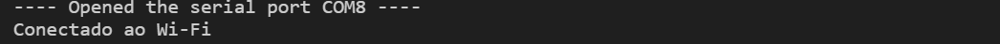
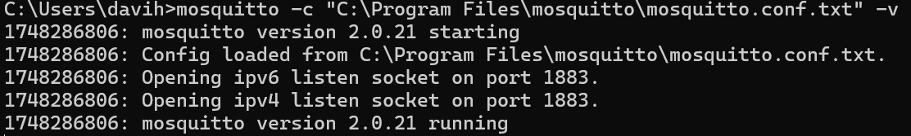
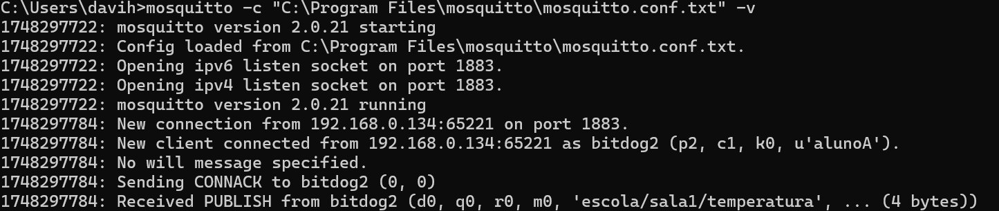
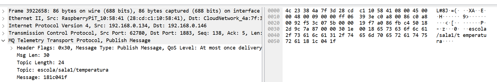
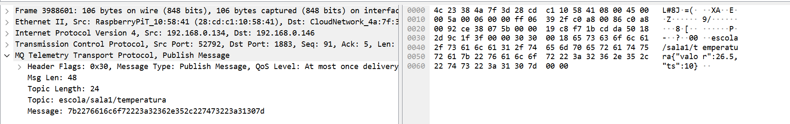
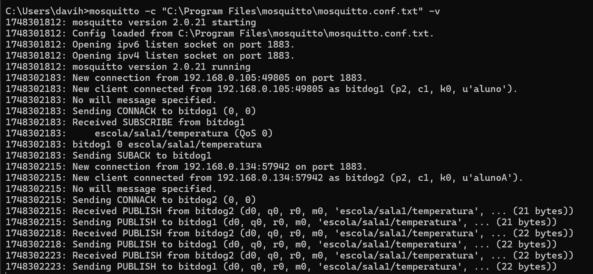

# Tarefa: IoT Security Lab - EmbarcaTech 2025

Autor: **Davi Henrique Vieira Lima**

Curso: Residência Tecnológica em Sistemas Embarcados

Instituição: EmbarcaTech - HBr

Brasília, Maio de 2025

---

# 🎯 Objetivos
A implementação da autenticação, criptografia e proteção contra ataques (*sniffing* e *replay*) na comunicação Wi-Fi com o protocolo MQTT tem como objetivos:
- Configurar uma comunicação MQTT básica via Wi-Fi utilizando a BitDogLab
- Aplicar autenticação no broker Mosquitto
- Implementar criptografia leve (XOR)
- Garantir a segurança por meio da proteção contra os ataques de *sniffing* e *replay*

 

# 💬 Comunicação MQTT
O MQTT é um protocolo de comunicação leve baseado no modelo **Publish/Subscribe**, sendo ideal para aplicações IoT. Os principais elementos são:
- Broker: consiste em um servidor responsável pelo gerenciamento das mensagens entre os publicadores e os assinantes de um tópico.
- Client: o cliente pode ser tanto um publicador quanto um assinante.
- Topic: consiste em um canal hierárquico de informação.

Dessa forma, os clientes podem publicar mensagens em tópicos ou assinar tópicos para receber dados sempre que houver novas publicações.

Por fim, QoS (Qualidade de Serviço) é responsável por definir o nível de garantia da entrega da mensagem.

 

# 🧰 Materiais Necessários
- 2 placas BitDogLab com Raspberry Pi Pico W 
- Rede Wi-Fi protegida 
- Notebook/Desktop com:
   - VSCode + extensões CMake e Pico SDK
   - Mosquitto instalado (broker local) e configurado no path do SO
   - Wireshark instalado
- Scripts base para MQTT em C (pico-mqtt-c ou wrapper lwIP)

 

# 📌 Detalhes Importantes
No repositório, observa-se as seguintes branches:
- `main`: branch para o *Publisher*
- `subscriber`: branch para o *Subscriber*

⚠️ ATENÇÃO: para passar o firmware para uma BitDogLab, deve-se atentar a qual branch está sendo utilizada.

*Exemplo: caso eu queria que minha BitDogLab seja um "Publisher", vou para a branch `main`. Somente assim, posso compilar o projeto e passar o firmware para BitDogLab. Já caso eu queria que minha BitDogLab seja um "Subscriber", vou para a branch `subscriber` e compilo meu projeto.*

 

# 🚀 Etapas da Execução
## Etapa 1: Conectando a BitDogLab ao Wi-Fi
O arquivo `wifi_conn.c` contém as implementações necessárias para conectar a BitDogLab ao Wi-Fi.
Utilizando SDK Pico W (biblioteca `cyw43_arch`) + lwIP, inicializa-se o chip Wi-Fi da Pico W e conecta-se a uma rede com base no SSID e senha da rede.

Após compilar e executar o projeto, no monitor serial do VS Code, é esperado o seguinte resultado:
 

## Etapa 2: Inicialização do broker MQTT
Após a instalação do Mosquitto e sua configuração no sistema operacional, abre-se o *prompt command* e se executa o seguinte comando: `mosquitto -c "C:\Program Files\mosquitto\mosquitto.conf" -v` ou `mosquitto -c "C:\Program Files\mosquitto\mosquitto.conf.txt" -v`.

Obs.: Ajuste o path do `mosquitto.conf` de acordo a sua organização de arquivos.

Feito isso, é esperado o seguinte resultado:
 

## Etapa 3: Setup MQTT básico para IoT
No arquivo `mqtt_comm.c`, há a lógica de comunicação MQTT utilizando a biblioteca lwIP, voltada para aplicações embarcadas, como o Raspberry Pi Pico W. O código define as funções de conexão, publicação, inscrição e recepção de mensagens MQTT, acompanhado do tratamento de mensagens no formato JSON.

Obs.: informações relativas a variáveis e funções pode ser encontradas nos comentários do código.

Vale ressaltar que o arquivo `lwipopts.h`, é responsável pela configuração das opções de compilação da pilha LWIP, otimização memória e desempenho e habilitação de funcionalidades específicas para o projeto.

## Etapa 4: Conexão e Publicação MQTT sem Autenticação
Nesta etapa, após a conexão a rede Wi-Fi e setup da comunicação MQTT para o *publisher* (identificado unicamente como "**bitdog2**"), no loop principal do função main do arquivo `iot_security_lab.c`, é executado o método `mqtt_comm_publish("escola/sala1/temperatura", mensagem, strlen(mensagem));`, responsável por fazer uma publicação no tópico "escola/sala1/temperatura".

Obs.: importante deixar comentado os demais comandos que estão dentro da função `main`.

Pela lógica de implementação, a mesma publicação será feita a cada 5 segundos.

No *prompt de command* em que foi inicializado o broker, é esperado o seguinte resultado:
 

No Wireshark, é possível ver o conteúdo legível:
 

## Etapa 5: Autenticação Básica no Mosquitto
A autenticação é uma implementação essencial para controlar o acesso a recursos da comunicação MQTT.
Para garantir isso, no arquivo `mosquitto.conf`, é necessário incluir os seguintes comandos: 
- *allow_anonymous false* : impede conexões anônimas ao broker
- *password_file /etc/mosquitto/passwd (ou equivalente no seu SO)* : define o caminho do arquivo de senhas
- *listener 1883* : indica ao broker para escutar conexões da porta 1883

Após isso, para criar o arquivo de senhas, é necessário executar, no *prompt command*, o seguinte comando: 
`mosquitto_passwd -c C:\mosquitto\config\passwd alunoA`

Com isso, será pedido uma senha. Para estar em acordo com o arquivo `iot_security_lab.c`, é importante escolher a seguinte senha: **senha12345**

O resultado esperado é a conexão ao broker, assim como foi mostrado na etapa anterior.

## Etapa 6: Simulação de Criptografia Leve (XOR)
Para mitigar ataques de *sniffing* — ou seja, a interceptação passiva dos dados transmitidos pela rede — é implementado um mecanismo simples de criptografia utilizando a operação XOR. Nesse método, cada byte da mensagem é combinado com uma chave (neste caso, o número **42**) usando a operação lógica XOR, resultando em um conteúdo ofuscado.

Esse mecanismo está implemntado no arquivo `xor_cipher.c`.

Com o comando `mqtt_comm_publish("escola/sala1/temperatura", criptografada, strlen(mensagem));`, a mensagem criptografada é publicada.

Obs.: importante deixar comentado os demais comandos que estão dentro da função `main`.

No Wireshark, é mostrado o conteúdo ofuscado:
 

## Etapa 7: Publicação com Timestamp
Para mitigar ataques do tipo *replay* — em que um atacante armazena um pacote legítimo e o reenvia posteriormente — é adicionado um **timestamp** à mensagem publicada.

Dessa forma, o *subscriber* que recebe a mensagem pode verificar, com base no timestamp, se ela ainda é válida ou se trata de uma tentativa de reenvio indevido (*replay*).

Para implementar isso, é necessário inicializar um buffer para armazenar uma string JSON formatada com a **informação a ser publicada** e um **timestamp**.

Com o comando `sprintf(buffer, "{\"valor\":26.5,\"ts\":%lu}", time(NULL));`, a string JSON é formatada.

Com o comando `mqtt_comm_publish("escola/sala1/temperatura", buffer, strlen(buffer));`, a mensagem com o Timestamp é publicada.

No Wireshark, é mostrado:
 

## Etapa 8: Implementação do Subscriber
Para a verificação TimeStamp publicado pelo *Publisher*, é necessário a implementação de um firmware para o *Subscriber*. Para isso, foi desenvolvido outro arquivo `iot_security_lab.c` na branch `subscriber`.

Antes de desenvolver o código desse arquivo, foi necessário definir um conjunto de variáveis e funções, no arquivo `mqtt_comm.c` que permitissem ao dispositivo se inscrever em um tópico, receber as mensagens e verificar o Timestamp.

Informações detalhadas acerca dessas definições podem ser encontradas nos comentários do código.

Antes do setup da comunicação MQTT, é necessário promover a autenticação no Broker para o *subscriber*, seguindo as orientações descritas na Etapa 5.

Após o setup da comunicação para o *subscriber* (identificado unicamente como "**bitdog1**"), por meio do comando `mqtt_comm_subscribe("escola/sala1/temperatura");`, o dispositivo solicita a inscrição em um tópico MQTT específico. 

Com a execução do *Publisher* em uma BitDogLab e do *Subscriber* em outra, é esperado o seguinte resultado no *prompt command* em que está rodando o Broker:
 

Obs.: todas mensagens publicadas sem o Timestamp são consideradas uma tentativa de *replay* pelo *Subscriber*.

 

# 🧠 Discussão
- Quais técnicas são escaláveis?

   Em relação à escalabilidade, devido à leveza e eficiência do protocolo MQTT, observa-se que ele é altamente escalável em razão do desacoplamento entre remetentes e destinatórios.
   Além disso, destaca-se a autenticação no contexto da escalabilidade por fornecer controle sobre o acesso dos clientes à medida que a rede cresce, mantendo a segurança e a integridade do sistema. 
   Junto a isso, o uso de timestamps  pode ser estendido para soluções mais robustas, tais como a sincronização NTP ou verificação de nonce/token, reforçando a proteção contra ataques de replay.
   Por fim, a estrutura modular com SDK Pico + lwIP facilita a manutenção e reuso de código para múltiplos dispositivos, promovendo um desenvolvimento mais ágil e sustentável em aplicações de larga escala..

- Como aplicá-las com várias BitDogLab em rede escolar ?

   Para aplicar as técnicas descritas anteriormente em uma rede escolar, os seguintes fatores são essenciais:

   - Infraestrutura de Rede: a rede da escola deve apresentar Wi-Fi para conectar as BitDogLabs, uma largura de banda suficiente para suportar múltiplos dispositivos e um servidor local para o gerenciamento das informações
   - Autenticação: a fim de garantir que apenas alunos da rede escolar tenha acesso às informações e evitar o *spoffing*, atacante se passa por um usuário, é necessário aplicar um mecanismo de autenticação no broker MQTT.
   - Timestamps: com intuito de evitar duplicações e reenvios maliciosos que possam prejudicar o desempenho acadêmico do aluno, é necessário o uso de Timestamps para verificação da integridade da mensagem.
   - Criptografia de Transporte: para evitar o *sniffing*, escuta passiva do tráfego, é necessário criptografar os dados transportados pela rede, protegendo, assim, dados sensíveis, tais como nota do aluno, resposta da prova, entre outros.

 

---

## 📜 Licença
GNU GPL-3.0.
